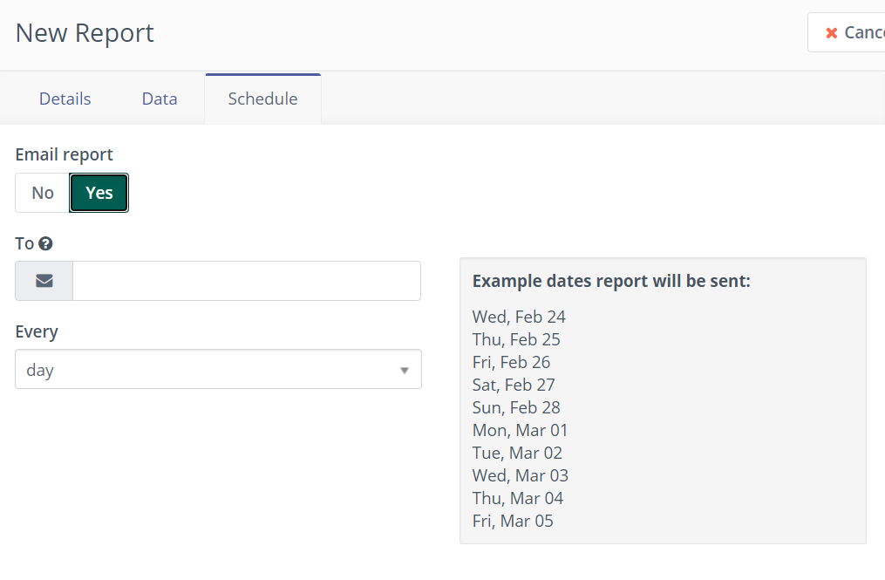

-----------

You can access existing reports and create new customized reports through Mautic's Report menu.

To create new report click on '+ New' button on the top right of the page.

Below are the options available on a new report page - 

1. [Details](#Details)
2. [Data](#Data)
3. [Schedule](#Schedule)

# Details

You can select a name for your report and an optional description.

Choose the data source appropriate for the report type you want. Each data source has a different set of available columns & filters. Types of data sources available in reports are as below -

1. Assets
   1. Assets
   2. Asset Downloads
2. Campaigns
   1. Campaign Events
3. Channels Messages
   1. Message Queue
4. Emails
   1. Emails
   2. Emails Sent
5. Forms
   1. Forms
   2. Form Submissions
6. Contacts
   1. Contacts
   2. Multi Touch Attributions
   3. Contact Point Log
   4. Frequency Rules
   5. Segment Membership
   6. Do Not Contact
   7. UTM Codes
7. Companies
   1. Companies
8. Mobile Notifications
   1. Mobile Notifications
   2. Mobile Notifications Sent
9. Pages
   1. Landing Pages
   2. Page hits
10. Videos
    1. Video hits

# Data

Each report can be customized to include the columns of choice. These would depend on the data  source selected.

Filter data based on set criteria and/or set a specific order for the data.
In addition you can also group by and select different function operators to calculate fields. Note that when you select functions operators a totals row will be added to the report. This totals row will not be exported when selecting to export a report.

# Schedule

You can schedule a report to be sent out to emails you specify on a daily, weekly or monthly basis.

